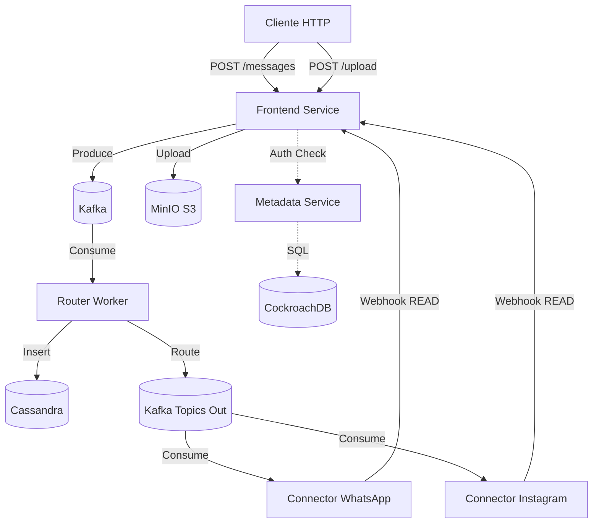

Com certeza\! O seu README já está ótimo, mas para refletir a realidade atual do projeto (com MinIO, Connectors e Status Completo), precisamos atualizar algumas seções chave.

Aqui está o **README.md** completo e atualizado. Copie e substitua o seu arquivo atual.

-----

# Chat4All v2 - Sistema de Mensageria Distribuída

Sistema de chat distribuído baseado em microsserviços, projetado para alta escalabilidade e resiliência. A arquitetura utiliza processamento de eventos (Kafka), persistência poliglota (Cassandra + CockroachDB) e armazenamento de objetos (MinIO), simulando um ambiente de produção real com integração externa (WhatsApp/Instagram).

## 📋 Índice

  - [Visão Geral](https://www.google.com/search?q=%23vis%C3%A3o-geral)
  - [Arquitetura](https://www.google.com/search?q=%23arquitetura)
  - [Tecnologias](https://www.google.com/search?q=%23tecnologias)
  - [Estrutura do Projeto](https://www.google.com/search?q=%23estrutura-do-projeto)
  - [Serviços](https://www.google.com/search?q=%23servi%C3%A7os)
  - [Instalação e Execução](https://www.google.com/search?q=%23instala%C3%A7%C3%A3o-e-execu%C3%A7%C3%A3o)
  - [Fluxo de Mensagens](https://www.google.com/search?q=%23fluxo-de-mensagens)
  - [Endpoints da API](https://www.google.com/search?q=%23endpoints-da-api)
  - [Configuração](https://www.google.com/search?q=%23configura%C3%A7%C3%A3o)
  - [Troubleshooting](https://www.google.com/search?q=%23troubleshooting)

## 🎯 Visão Geral

O Chat4All implementa uma arquitetura orientada a eventos onde a API de entrada apenas enfileira solicitações, garantindo alta disponibilidade. Workers em background processam as mensagens, salvam no banco e roteiam para conectores externos, completando o ciclo de vida da mensagem (`SENT` → `DELIVERED` → `READ`).

### Características Principais

  - **Arquitetura de Microsserviços**: Separação clara de responsabilidades.
  - **Mensageria Assíncrona**: Apache Kafka para desacoplamento total.
  - **Persistência Poliglota**:
      - **Cassandra**: Histórico de chat (alta escrita).
      - **CockroachDB**: Dados de usuários e metadados (transacional).
      - **MinIO (S3)**: Armazenamento de arquivos (imagens, documentos).
  - **Integração Externa Mock**: Simuladores de WhatsApp e Instagram.
  - **Autenticação JWT**: Segurança via tokens.
  - **Containerização Completa**: Docker Compose orquestrando 9 serviços.

## 🏗️ Arquitetura



## 🛠️ Tecnologias

### Backend

  - **Python 3.11**: Linguagem base.
  - **FastAPI**: API Gateway e Metadata Service.
  - **Kafka-Python**: Produtores e Consumidores.
  - **Cassandra Driver**: Conexão NoSQL.
  - **SQLAlchemy**: ORM para CockroachDB.
  - **Boto3**: Cliente S3 para MinIO.
  - **Pydantic**: Validação de dados.

### Infraestrutura

  - **Docker Compose**: Orquestração.
  - **Apache Kafka + Zookeeper**: Event Bus.
  - **Apache Cassandra**: Chat Log Store.
  - **CockroachDB**: User Store.
  - **MinIO**: Object Storage.

## 📁 Estrutura do Projeto

```
Chat4All/
├── docker-compose.yml          # Definição da infraestrutura
├── services/
│   ├── frontend_service/       # API Principal (Msg + Upload)
│   │   ├── app/
│   │   │   ├── main.py         # Endpoints
│   │   │   ├── s3.py           # Integração MinIO
│   │   │   └── producer.py     # Kafka Producer
│   ├── router_worker/          # Worker Central (Router + DB)
│   ├── metadata_service/       # API de Usuários (CockroachDB)
│   ├── connector_whatsapp/     # Mock de Integração
│   └── connector_instagram/    # Mock de Integração
```

## 🔧 Serviços e Portas

| Serviço | Porta Host | Descrição |
| :--- | :--- | :--- |
| **Frontend API** | `8000` | API Principal (Mensagens, Arquivos). |
| **Metadata API** | `8001` | API de Gestão de Usuários. |
| **MinIO Console** | `9001` | Painel Admin de Arquivos (User/Pass: `minioadmin`). |
| **MinIO API** | `9000` | Endpoint S3. |
| **CockroachDB UI** | `8080` | Painel do Banco SQL. |
| **Cassandra** | `9042` | Banco NoSQL. |
| **Kafka** | `29092` | Broker (Acesso externo). |

## 🚀 Instalação e Execução

### 1\. Iniciar o Ecossistema

```bash
# Sobe toda a infraestrutura e constrói os serviços Python
docker-compose up -d --build
```

### 2\. Configurar o Banco de Dados (Apenas 1ª vez)

O Cassandra precisa da tabela criada manualmente (pois o script automático é complexo de sincronizar).

```bash
docker-compose exec cassandra cqlsh -e "
CREATE KEYSPACE IF NOT EXISTS chat4all_ks WITH replication = {'class': 'SimpleStrategy', 'replication_factor': '1'};
USE chat4all_ks;
CREATE TABLE IF NOT EXISTS messages (
    conversation_id uuid,
    message_id uuid,
    sender_id text,
    content text,
    status text,
    created_at timestamp,
    type text,
    file_id text,
    PRIMARY KEY (conversation_id, message_id)
) WITH CLUSTERING ORDER BY (message_id DESC);"
```

### 3\. Reiniciar Workers (Para pegar a tabela nova)

```bash
docker-compose restart router_worker frontend_service
```

## 📨 Fluxo de Mensagens (Ciclo de Vida)

1.  **SENT**: API recebe, salva arquivo no MinIO (se houver), publica no Kafka `chat_messages`.
2.  **DELIVERED**: Worker consome, define tipo (texto/arquivo), salva no Cassandra e roteia para o tópico de saída (`whatsapp_outbound` ou `instagram_outbound`).
3.  **READ**: Connector consome, simula envio externo e chama webhook `PATCH /status` na API, que atualiza o Cassandra.

## 🔌 Endpoints Principais

### 1\. Autenticação

**POST** `/token`

  * Body: `username=bruno`, `password=test`
  * Retorna: `access_token`

### 2\. Upload de Arquivo

**POST** `/v1/files/upload`

  * Header: `Authorization: Bearer <token>`
  * Body (form-data): `file` (Arquivo binário)
  * Retorna: `file_id`, `download_url`

### 3\. Enviar Mensagem

**POST** `/v1/messages`

  * Header: `Authorization: Bearer <token>`
  * Body (JSON):
    ```json
    {
      "chat_id": "uuid-da-conversa",
      "content": "@maria veja a foto",
      "file_id": "uuid-do-arquivo-opcional"
    }
    ```
      * *Dica:* Se começar com `@`, vai para o Instagram Mock.

### 4\. Histórico

**GET** `/v1/conversations/{id}/messages`

  * Retorna lista completa com status atualizado (`READ`).

## ⚙️ Desenvolvimento Local

Para rodar sem Docker (apenas Python local conectando na infra Docker):

1.  **Infra:** `docker-compose up -d zookeeper kafka cassandra cockroachdb minio`
2.  **Env Vars:** Configure `.env` para apontar para `localhost` (ex: `KAFKA_BROKER_URL=localhost:29092`).
3.  **Install:** `pip install -r requirements.txt`
4.  **Run:** `uvicorn app.main:app --reload --port 8000`

-----

**Autores:** Bruno Evangelista Bertoldo -  Augusto Arantes Chaves - Enzo Alvarez Dias - Matheus Pereira Figueredo

**Última atualização:** 24/11/2025

